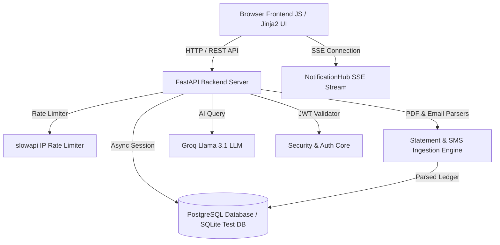

# FinAdvisor

A production-ready, highly polished personal finance and credit advisory application built with a modern async Python backend and a premium, responsive glassmorphic frontend UI.

---

## 🚀 Key Features

* **🔥 Snapchat-Style Login Streak**: Relocated to the top navbar next to the notification bell, featuring an animated flame emoji (`🔥 N`) with gradient counter styling, "hot" pulse state for 7+ day streaks, and global visibility on all pages.
* **🛡️ API Security & Rate Limiting (`slowapi`)**: Built-in IP rate limiting protecting critical routes against brute-force attacks (`/auth/login` 5/min, `/auth/register` 3/min, `/chatbot/ask` 20/min, `/sms/receive` 30/min).
* **🧪 Automated Test Suite (`pytest`)**: 37 automated unit and integration tests covering auth, cards CRUD, transactions, percentile daily spending, CSV export, milestone badges, crypto encryption, SMS/EMI/PDF parsing, and cross-user security boundaries.
* **📊 365-Day Adaptive Spending Heatmap**: A GitHub-style contribution heatmap displaying daily spending aggregates for the past 365 days, with automatic dynamic percentile color thresholds (`p25`, `p50`, `p75`).
* **🏦 Card Comparison Tool & Radar Chart**: Select up to 3 cards side-by-side to compare credit limits, balances, annual fees, and monthly EMI burdens, complete with a 5-axis Chart.js Radar comparison chart and automated card choice recommendations.
* **🔔 Live Notification Hub (SSE)**: Real-time notification bell in the navbar with unread count badges and dropdown. Streams live alerts via Server-Sent Events (SSE) with persistent DB storage and mark-as-read toggles.
* **🏆 Achievement Badges (Trophy Case)**: A gamified rewards panel with 10 financial milestone badges (Shield Up, Streak Master, Card Collector, Data Driven, Budget Boss, etc.) evaluated dynamically with bounce & glow keyframe animations.
* **🎯 Onboarding Checklist Flow**: A guided 3-step dashboard wizard (Add Card → Connect Gmail → Set Monthly Budget) complete with an SVG progress ring and inline budget limits setup.
* **🤖 Dual-Engine AI Assistant (Groq LLM + Templates)**: Context-aware AI chatbot powered by Groq (`llama-3.1-8b-instant`) and pre-seeded database query templates to analyze user cards, transactions, and EMI balances.
* **📄 Multi-Bank Statement Parser**: Parses credit card PDF statements (ICICI, HDFC, SBI, Axis, Kotak, IndusInd, IDFC, Yes Bank) and SMS/email alerts with automatic password combination generation.
* **📱 Responsive Glassmorphic UI**: Custom CSS3 design tokens with 6 dynamic themes (Default, Midnight Aurora, Warm Charcoal, Graphite, Emerald, Amber) and touch-friendly mobile layouts.

---

## 🏗️ System Architecture



---

## 🛠️ Technology Stack

* **Backend**: FastAPI (Python 3.11/3.12), SQLAlchemy 2.0 (AsyncORM), `asyncpg` / `aiosqlite`, Alembic, PyJWT, Passlib (bcrypt/argon2), `slowapi`, `pdfplumber`, APScheduler
* **Frontend**: Vanilla HTML5, CSS3 Glassmorphism tokens, Vanilla JavaScript (Modular SPA controllers), Chart.js 4.x, Lucide Icons, EventSource (SSE)
* **Testing**: `pytest`, `pytest-asyncio`, `httpx`

---

## 💻 Local Setup

1. Create a virtual environment and install dependencies:
```bash
# On Windows
py -3.12 -m venv venv
.\venv\Scripts\Activate.ps1

# On Mac/Linux
python3 -m venv venv
source venv/bin/activate

# Install dependencies
pip install -r requirements.txt
```

2. Create a `.env` file (copy from `.env.example`):
```bash
cp .env.example .env
```

3. Run database migrations:
```bash
alembic upgrade head
```

4. Start the development server:
```bash
uvicorn main:app --reload --port 8000
```
Open `http://127.0.0.1:8000` in your browser.

---

## 🧪 Running Automated Tests

Run the complete 37-test suite with `pytest`:

```bash
# Run all tests
pytest

# Run with verbose output
pytest -v

# Run a specific test file
pytest tests/test_api_auth.py -v
```

---

## 🔌 Core API Endpoints

| Category | Method | Endpoint | Description |
|---|---|---|---|
| **Auth** | `POST` | `/api/v1/auth/register` | Register new user account *(Rate limited: 3/min)* |
| **Auth** | `POST` | `/api/v1/auth/login` | Authenticate user & evaluate streak *(Rate limited: 5/min)* |
| **Cards** | `GET` | `/api/v1/cards/` | List active cards for user |
| **Cards** | `POST` | `/api/v1/cards/` | Add card & seed default bank benefits |
| **Cards** | `GET` | `/api/v1/cards/{id}/details` | Calculated utilization & EMI payoff details |
| **Transactions**| `GET` | `/api/v1/transactions/` | Filterable transaction ledger |
| **Transactions**| `GET` | `/api/v1/transactions/daily-spending` | 365-day spending heatmap with `p25/p50/p75` thresholds |
| **Transactions**| `GET` | `/api/v1/transactions/export/csv` | Download CSV export of transaction history |
| **Users** | `GET` | `/api/v1/users/{id}/badges` | Evaluate 10 gamification milestone badges |
| **Users** | `POST` | `/api/v1/users/{id}/budget` | Set monthly budget goal limit |
| **Notifications**| `GET` | `/api/v1/notifications/stream/{id}` | Real-time Server-Sent Events (SSE) stream |
| **Chatbot** | `POST` | `/api/v1/chatbot/ask` | Natural language AI financial assistant *(Rate limited: 20/min)* |

---

## 🐳 Docker Deployment

Run the app and database with Docker Compose:

```bash
docker compose up --build
```
Access the application at `http://localhost:8000`.

To stop containers:
```bash
docker compose down
```

